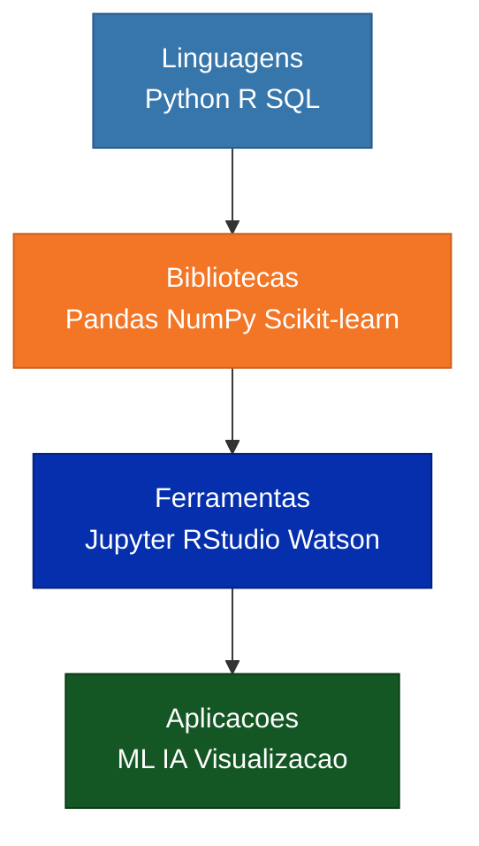

# Jupyter Notebook - Data Science Ecosystem

<div align="center">


[](Dockerfile)

**[PT-BR](#sobre-o-projeto) | [English](#about-the-project)**

</div>

---

<a name="sobre-o-projeto"></a>

## Sobre o Projeto

> Projeto desenvolvido durante a certificacao **IBM Data Science Professional Certificate** no [Coursera](https://www.coursera.org/)

Este repositorio contem o notebook final do curso introdutorio de Data Science da IBM, onde sao explorados os fundamentos do ecossistema de ciencia de dados: linguagens de programacao, bibliotecas, ferramentas e conceitos essenciais para a area.

---

## Ecossistema de Data Science



---

## Conteudo

| Arquivo | Descricao |
|---|---|
| `DataScienceEcosystem.ipynb` | Notebook principal com resumo do ecossistema |
| `LICENSE` | Licenca MIT |

## Como Executar

```bash
git clone https://github.com/galafis/Jupyter-Notebook.git
cd Jupyter-Notebook
jupyter notebook DataScienceEcosystem.ipynb
```

## Aplicacao na Industria

Compreender o ecossistema de ferramentas de ciencia de dados e fundamental para selecionar a stack correta para cada projeto, otimizando produtividade e resultados.

---

<a name="about-the-project"></a>

## English

### About the Project

> Project developed during the **IBM Data Science Professional Certificate** on [Coursera](https://www.coursera.org/)

This repository contains the final notebook from IBM's introductory Data Science course, exploring the fundamentals of the data science ecosystem: programming languages, libraries, tools, and essential concepts.

---

## Licenca | License

Este projeto esta licenciado sob a [Licenca MIT](LICENSE). | This project is licensed under the [MIT License](LICENSE).

---

Developed by [Gabriel Demetrios Lafis](https://github.com/galafis)
